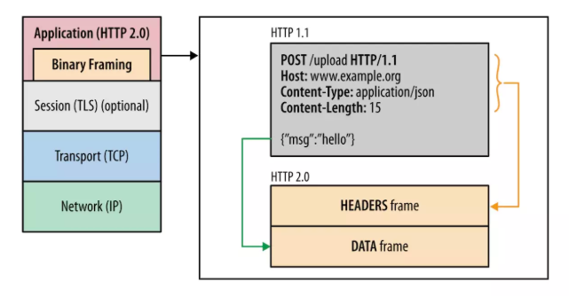
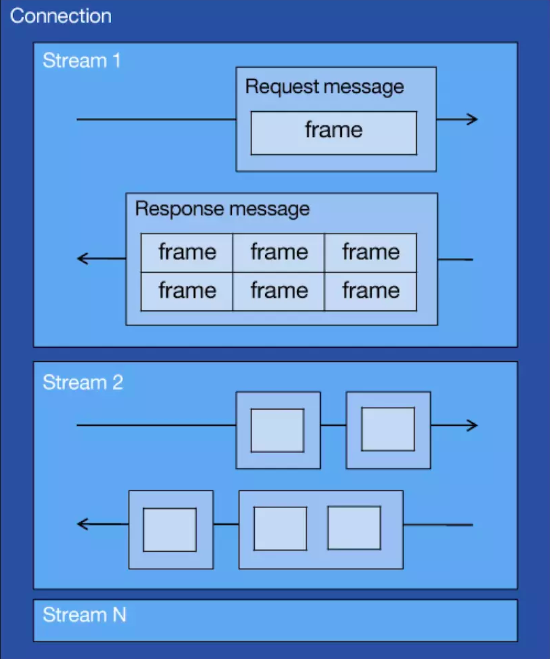

### HTTP 基本优化
影响一个 HTTP 网络请求的因素主要有两个：带宽和延迟。

* 带宽：如果说我们还停留在拨号上网的阶段，带宽可能会成为一个比较严重影响请求的问题，但是现在网络基础建设已经使得带宽得到极大的提升，我们不再会担心由带宽而影响网速，那么就只剩下延迟了。

* 延迟：
	* **浏览器阻塞（HOL blocking）**：浏览器会因为一些原因阻塞请求。浏览器对于同一个域名，同时只能有 4 个连接（这个根据浏览器内核不同可能会有所差异），超过浏览器最大连接数限制，后续请求就会被阻塞。
	* **DNS 查询（DNS Lookup）**：浏览器需要知道目标服务器的 IP 才能建立连接。将域名解析为 IP 的这个系统就是 DNS。这个通常可以利用DNS缓存结果来达到减少这个时间的目的。
	* **建立连接（Initial connection）**：HTTP 是基于 TCP 协议的，浏览器最快也要在第三次握手时才能捎带 HTTP 请求报文，达到真正的建立连接，但是这些连接无法复用会导致每次请求都经历三次握手和慢启动。三次握手在高延迟的场景下影响较明显，慢启动则对文件类大请求影响较大。

### HTTP1.0和HTTP1.1的一些区别

1. **缓存处理**，在HTTP1.0中主要使用header里的If-Modified-Since,Expires来做为缓存判断的标准，HTTP1.1则引入了更多的缓存控制策略例如Entity tag，If-Unmodified-Since, If-Match, If-None-Match等更多可供选择的缓存头来控制缓存策略。
2. **带宽优化及网络连接的使用**，HTTP1.0中，存在一些浪费带宽的现象，例如客户端只是需要某个对象的一部分，而服务器却将整个对象送过来了，并且不支持断点续传功能，HTTP1.1则在请求头引入了range头域，**它允许只请求资源的某个部分**，即返回码是206（Partial Content），这样就方便了开发者自由的选择以便于充分利用带宽和连接。
3. **错误通知的管理**，在HTTP1.1中新增了24个错误状态响应码，如409（Conflict）表示请求的资源与资源的当前状态发生冲突；410（Gone）表示服务器上的某个资源被永久性的删除。
4. **Host头处理**，在HTTP1.0中认为每台服务器都绑定一个唯一的IP地址，因此，请求消息中的URL并没有传递主机名（hostname）。但随着虚拟主机技术的发展，在一台物理服务器上可以存在多个虚拟主机（Multi-homed Web Servers），并且它们共享一个IP地址。HTTP1.1的请求消息和响应消息都应支持Host头域，且请求消息中如果没有Host头域会报告一个错误（400 Bad Request）。
5. **长连接**，HTTP 1.1支持长连接（PersistentConnection）和请求的流水线（Pipelining）处理，在一个TCP连接上可以传送多个HTTP请求和响应，减少了建立和关闭连接的消耗和延迟，在HTTP1.1中默认开启Connection： keep-alive，一定程度上弥补了HTTP1.0每次请求都要创建连接的缺点。

### HTTP/2的主要变化
待续...

1. 二进制分帧层

   

   * 响应是文本格式，而2.0把响应划分成了两个帧，图中的HEADERS（首部）和DATA（消息负载） 是帧的类型，也就是说一条HTTP响应，划分成了两个帧来传输，并且采用二进制来编码。
   * 流（Stream）：已建立的TCP连接上的双向字节流，可以承载一个或多个消息。
   * 消息（Message）：一个完整的HTTP请求或响应，由一个或多个帧组成。特定消息的帧在同一个流上发送，这意味着一个HTTP请求或响应只能在一个流上发送。
   * 帧（Frame）：通信的基本单位。
      一个TCP连接上可以有任意数量的流。

2. 多路复用

   * HTTP2让所有的通信都在一个TCP连接上完成，真正实现了请求的并发。
   * 
   * HTTP2建立一个TCP连接，一个连接上面可以有任意多个流（stream），消息分割成一个或多个帧在流里面传输。帧传输过去以后，再进行重组，形成一个完整的请求或响应。这使得所有的请求或响应都无法阻塞。

3. 头部压缩

   * 在1.X版本中，首部用文本格式传输，通常会给每个传输增加500-800字节的开销。现在打开一个网页上百个请求已是常态，而每个请求带的一些首部字段都是相同的，例如cookie、user-agent等。HTTP2为此采用HPACK压缩格式来压缩首部。头部压缩需要在浏览器和服务器端之间：

     * 维护一份相同的静态字典，包含常见的头部名称，以及常见的头部名称和值的组合

     - 维护一份相同的动态字典，可以动态的添加内容
     - 通过静态Huffman编码对传输的首部字段进行编码

4. 服务器端推送

   * 服务器端推送使得服务器可以预测客户端需要的资源，主动推送到客户端。
      例如：客户端请求index.html，服务器端能够额外推送script.js和style.css。 实现原理就是客户端发出页面请求时，服务器端能够分析这个页面所依赖的其他资源，主动推送到客户端的缓存，当客户端收到原始网页的请求时，它需要的资源已经位于缓存。
   * 针对每一个希望发送的资源，服务器会发送一个PUSH_PROMISE帧，客户端可以通过发送RST_STREAM帧来拒绝推送（当资源已经位于缓存）。这一步的操作先于父响应（index.html），客户端了解到服务器端打算推送哪些资源，就不会再为这些资源创建重复请求。当客户端收到index.html的响应时，script.js和style.css已经位于缓存。

   