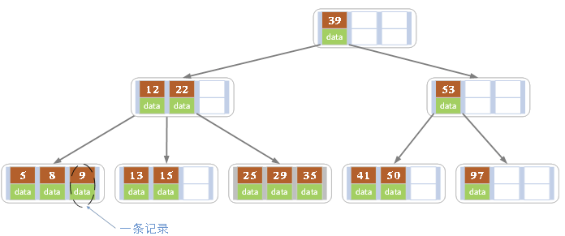
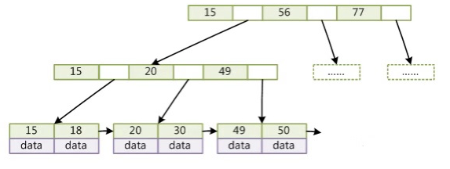
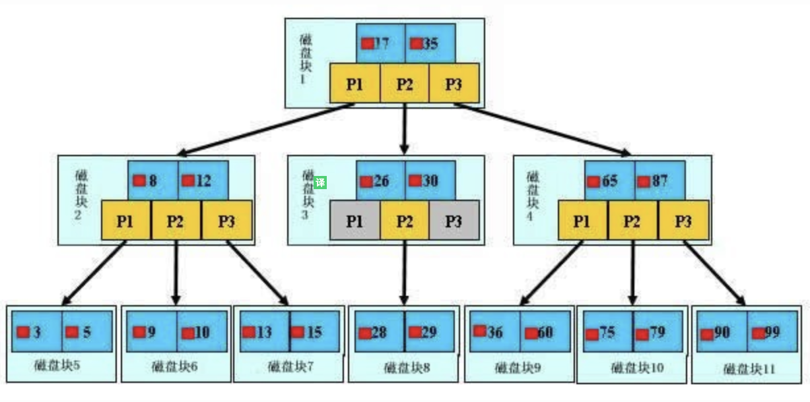
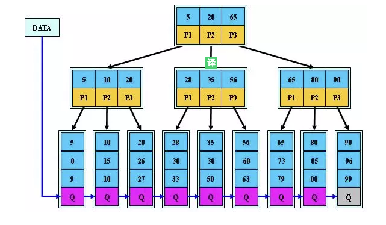

### ACID
**事务具有ACID的特性**

1. 原子性（Atomicity):  
	
	> 整个事务中的所有操作，要么全部完成，要么全部不完成，不可能停滞在中间某个环节。事务在执行过程中发生错误，会被回滚（Rollback）到事务开始前的状态，就像这个事务从来没有执行过一样。
	
2. 一致性（Consistency): 
	> 一个事务可以封装状态改变（除非它是一个只读的）。事务必须始终保持系统处于一致的状态，不管在任何给定的时间并发事务有多少。如果事务是并发多个，系统也必须如同串行事务一样操作。其主要特征是保护性和不变性(Preserving an Invariant)

3. 隔离性 (Isolation):
	> 隔离状态执行事务，使它们好像是系统在给定时间内执行的唯一操作。如果有两个事务，运行在相同的时间内，执行相同的功能，事务的隔离性将确保每一事务在系统中认为只有该事务在使用系统。这种属性有时称为串行化，为了防止事务操作间的混淆，必须串行化或序列化请求，使得在同一时间仅有一个请求用于同一数据。

4. 持久性 (Durability):
	> 在事务完成以后，该事务对数据库所作的更改便持久的保存在数据库之中，并不会被回滚。


### SQL预编译是什么？
**数据库执行sql语句可以理解为按照关键字来编译sql语句，而预编译后数据库肯定就不再重复编译了，所以这时再传什么 AND, OR都只会当成普通字符串来处理。** sql 预编译的语句能有效防止 sql 注入。


## 存储引擎
### MyISAM
> MyISAM基于ISAM存储引擎，并对其进行扩展。它是在Web、数据仓储和其他应用环境下最常使用的存储引擎之一。MyISAM拥有较高的插入、查询速度，但不支持事务。

MyISAM主要特性： 

1. 大文件（达到63位文件长度）在支持大文件的文件系统和操作系统上被支持。 
2. 当把删除和更新及插入操作混合使用的时候，动态尺寸的行产生更少碎片。这要通过合并相邻被删除的块，以及若下一个块被删除，就扩展到下一块自动完成。 
3. 每个MyISAM表最大索引数是64，这可以通过重新编译来改变。每个索引最大的列数是16 
4. NULL被允许在索引的列中，这个值占每个键的0~1个字节 
5. 可以把数据文件和索引文件放在不同目录（InnoDB是放在一个目录里面的）

### InnoDB
> InnoDB是事务型数据库的首选引擎，支持事务安全表（ACID），支持行锁定和外键。InnoDB是默认的MySQL引擎。

InnoDB主要特性：

1. InnoDB给MySQL提供了具有提交、回滚和崩溃恢复能力的事物安全（ACID兼容）存储引擎。InnoDB锁定在行级并且也在SELECT语句中提供一个类似Oracle的非锁定读。这些功能增加了多用户部署和性能。在SQL查询中，可以自由地将InnoDB类型的表和其他MySQL的表类型混合起来，甚至在同一个查询中也可以混合
2. InnoDB是为处理巨大数据量的最大性能设计。它的CPU效率可能是任何其他基于磁盘的关系型数据库引擎锁不能匹敌的
3. InnoDB存储引擎完全与MySQL服务器整合，InnoDB存储引擎为在主内存中缓存数据和索引而维持它自己的缓冲池。InnoDB将它的表和索引在一个逻辑表空间中，表空间可以包含数个文件（或原始磁盘文件）。这与MyISAM表不同，比如在MyISAM表中每个表被存放在分离的文件中。InnoDB表可以是任何尺寸，即使在文件尺寸被限制为2GB的操作系统上
4. InnoDB支持外键完整性约束，存储表中的数据时，每张表的存储都按主键顺序存放，如果没有显示在表定义时指定主键，InnoDB会为每一行生成一个6字节的ROWID，并以此作为主键。

### 两者比较

|| MyISAM | InnoDB |
|:---:|:---:|:---:|
|存储结构|每张表被存放在三个文件：1.frm-表格定义, 2.MYD(MYData)-数据文件,3.MYI(MYIndex)-索引文件|所有的表都保存在同一个数据文件中（也可能是多个文件，或者是独立的表空间文件），InnoDB表的大小只受限于操作系统文件的大小，一般为2GB|
|存储空间|MyISAM可被压缩，存储空间较小|InnoDB的表需要更多的内存和存储，它会在主内存中建立其专用的缓冲池用于高速缓冲数据和索引|
|可移植性、备份及恢复|由于MyISAM的数据是以文件的形式存储，所以在跨平台的数据转移中会很方便。在备份和恢复时可单独针对某个表进行操作|免费的方案可以是拷贝数据文件、备份 binlog，或者用 mysqldump，在数据量达到几十G的时候就相对痛苦了|
|事务安全|不支持 每次查询具有原子性|支持 具有事务(commit)、回滚(rollback)和崩溃修复能力(crash recovery capabilities)的事务安全(transaction-safe (ACID compliant))型表|
|AUTO_INCREMENT|	MyISAM表可以和其他字段一起建立联合索引|InnoDB中必须包含只有该字段的索引|
|SELECT|MyISAM更优||
|INSERT||InnoDB更优|
|UPDATE||InnoDB更优|
|DELETE||InnoDB更优 它不会重新建立表，而是一行一行的删除|
|COUNT without WHERE|MyISAM更优。因为MyISAM保存了表的具体行数|InnoDB没有保存表的具体行数，需要逐行扫描统计，就很慢了|
|COUNT with WHERE|两者相同|两者相同，InnoDB也会锁表|
|锁|只支持表锁|支持表锁、行锁。行锁大幅度提高了多用户并发操作的新能。但是InnoDB的行锁，只是在WHERE的主键是有效的，非主键的WHERE都会锁全表的|
|外键|不支持|支持|
|FULLTEXT全文索引|支持|不支持 可以通过使用Sphinx从InnoDB中获得全文索引，会慢一点|


###查询SQL编写注意点

1. 对查询进行优化，避免全表扫描。首先应考虑在 where 及 order by 涉及的列上建立索引。
2. 应尽量避免在 where 子句中对字段进行 null 值判断，否则将导致引擎放弃使用索引而进行全表扫描。可以在num上设置默认值0，确保表中num列没有null值。
3. in 和 not in 也要慎用，否则会导致全表扫描。对于连续的数值，能用 between 就不要用 in。很多时候用 exists 代替 in 是一个好的选择。
4. 尽量使用数字型字段。
5. 任何地方都不要使用 select * from t ，用具体的字段列表代替“*”，不要返回用不到的任何字段。
6. 如果应用程序有很多 JOIN 查询，应该确认两个表中Join的字段是被建过索引的。这样，MySQL内部会启动优化Join的SQL语句的机制。而且，这些被用来Join的字段，应该是相同的类型的。

### 索引
**优点**

1. 通过创建唯一性索引，可以保证数据库表中每一行数据的唯一性。
2. 可以大大加快数据的检索速度，这也是创建索引的最主要的原因。
3. 可以加速表和表之间的连接，特别是在实现数据的参考完整性方面特别有意义。
4. 在使用分组和排序 子句进行数据检索时，同样可以显著减少查询中分组和排序的时间。
5. 通过使用索引，可以在查询的过程中，使用优化隐藏器，提高系统的性能。

**缺点**

1. 创建索引和维护索引要耗费时间，这种时间随着数据量的增加而增加。
2. 索引需要占物理空间，除了数据表占数据空间之外，每一个索引还要占一定的物理空间，如果要建立聚簇索引，那么需要的空间就会更大。
3. 当对表中的数据进行增加、删除和修改的时候，索引也要动态的维护，这样就降低了数据的维护速度。

### 索引的数据结构
* B树性质



> 1. 每一个节点包括的信息：n表示结点中存储关键字的个数，比如上图上M的左孩子就存了2个关键字，D和H；x.key，说的是具体的关键字的信息，比如D，D实际是有2个部分组成，可以理解为一个map，{key: data}，x.key广义上就是表示这个map，包括了具体的key和存储的数据data，通常说是一条记录；x.leaf是说整个结点是否是叶子结点。
> 2. 如果不是叶子结点，每个结点还有一个属性，就是指向它n个孩子的指针。
> 3. 每个结点的关键字按小到大的顺序依次排列，同时各个结点之间也满足上面提到的二叉搜索树的特点，左孩子的值<父亲节点的值<右孩子的值。
> 4. 每个叶子结点高度一样，这也是平衡二字的由来。
> 5. 每个结点关键字的数量的限制，不可能每个结点可以无限存储关键字。t是最小度数，需要理解这些，可以谷歌一下度数和阶数的定义，上图是4阶的B-Tree。上图中t=2，则每个内部结点可以允许有2、3、4个孩子。孩子数范围[t, 2t]，每个结点的关键字范围[t-1, 2t-1]。这个要区分。

* B树查找特性

> 由于B-Tree的特性，在B-Tree中按key检索数据的算法非常高效：首先从根节点进行二分查找，如果找到则返回对应节点的data，否则对相应区间的指针指向的节点递归进行查找，直到找到节点或找到null指针，前者查找成功，后者查找失败。

* B+树


> B+树其实是B-树变种。 与B-树最大的区别是内部结点不存储data，只存储key。

> 数据库系统巧妙利用了磁盘预读原理，将一个节点的大小设为等于一个页，这样每个节点只需要一次I/O就可以完全载入。B-树也利用这一点，每次新建节点时，直接申请一个页的空间，这样就保证一个节点物理上也存储在一个页里，加之计算机存储分配都是按页对齐的，就实现了一次磁盘I/O就读取了一页的数据。下面是B-树的示例图：
> 

> 根据B-Tree的定义，可知检索一次最多需要访问h个节点（h个树的高度）。B-Tree中一次检索最多需要h-1次I/O（根节点常驻内存），渐进复杂度为O(h)=O(logdN)。一般实际应用中，出度d是非常大的数字，通常超过100，因此h非常小（通常不超过3）。所以B-Tree作为索引效率是非常高，相比平衡二叉树、红黑树要高很多，因为这些树的h一般都比较深。
> 

B+树比B-树更加适合作为磁盘的索引数据结构，原因是B+树的内部结点不存储data，内部结点的出度d越大，那么渐进复杂度越小。出度d的上限取决于节点内key和data的大小：
dmax=floor(pagesize/(keysize+datasize+pointsize))

一般3层B+树可以存储上百万的数据，也就是读取上百万的数据，只需要3次磁盘I/O，可见这效率，大大提升了。如果没有索引，那每次查询一次数据项，都需要一次I/O，几百万次，可怕。

### 意义
* 了解不同的引擎的实现原理，对于我们日常做数据库的设计是非常有帮助的。
* InnoDB辅助索引搜索需要检索两遍索引：首先检索辅助索引获得主键，然后用主键到主索引中检索获得记录，从而能够明白为什么不建议使用过长的字段作为主键，因为所有辅助索引都引用主索引，过长的主索引会令辅助索引变得过大。
* 不建议用非单调的字段作为InnoDB的主键，因为InnoDB数据文件本身是一颗B+Tree，非单调的主键会造成在插入新记录时，数据文件为了维持B+Tree的特性而频繁的分裂调整，十分低效，所以一般使用自增字段作为主键。


### Mysql优化原则_小表驱动大表IN和EXISTS的合理利用

如果两个表中一个较小，一个是大表，则子查询表大的用exists，子查询表小的用in： 
例如：表A（小表），表B（大表）

```sql
select * from A where cc in (select cc from B) ;//  效率低，用到了A表上cc列的索引；
select * from A where exists(select cc from B where cc=A.cc) ;// 效率高，用到了B表上cc列的索引。 
```

相反

```sql
select * from B where cc in (select cc from A) ; //效率高，用到了B表上cc列的索引；
select * from B where exists(select cc from A where cc=B.cc) ;//效率低，用到了A表上cc列的索引。
```


